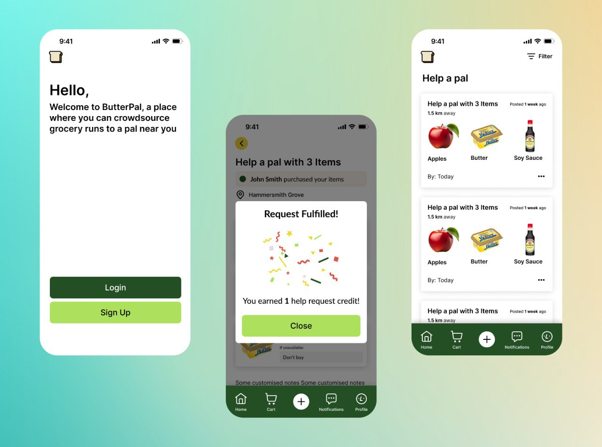

# 🧈 ButterPal - Crowdsourced Grocery Runs! 

## Description 
Innovative mobile app built with React Native and TypeScript to connect neighbours and crowdsource local grocery runs, saving you time and effort!



## Tech Stack

- React Native
- Typescript
- Postgre
- Node.js
- Expo
- Supabase


## Contributions
- Fullstack Mobile Engineer: [Kane Chang](https://github.com/kane-chang)
- UX Designer: [Han Yi](https://hanyi.design)


## Deployed App
- Deployed App: _To be launched soon_

## UI/UX Design
- [Figma Prototype](https://www.figma.com/proto/fXLP8uYmWrcwNdSjYI9UmT/ButterPal?node-id=28-1056&t=AIfB8MFwhs4JfqRh-1)

## Support 
For questions, issues, or collaboration opportunities, please visit our [GitHub repository](https://github.com/kane-chang/ButterPal) and feel free to reach out to contributors by creating a new issue or directly contacting them through the platform. 

## Future Contributions

To get started, run the below command to install dependencies.

```bash
npm i
```
